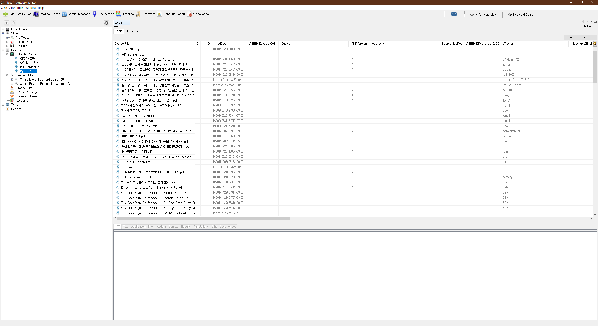

## Autopsy-DocumentMetadataIngestModule

Autopsy Plugin to extract metadata that exists in document files.

If the document file is corrupted, metadata is extracted by the code developed.

### Using Python Modules

BeautifulSoup4

PyPDF2

olefile